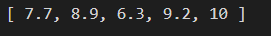
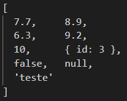
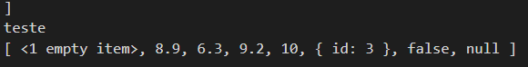

## Array

Estrutura indexavel, tem um indice anexado ao valor.

```jsx
const valores = [7.7, 8.9, 6.3, 9.2]
console.log(valores[0], valores[3])
//mostrando indice 0 e 3, 7.7 e 9.2
```

Não consegue mostrar número ligado a indice inexistente:

```jsx
const valores = [7.7, 8.9, 6.3, 9.2]
console.log(valores[0], valores[3])

console.log(valores[4])
//retorna UNDEFINED
```

Anexando mais um valor ao array:

```jsx
//anexando mais um valor ao array:
valores[4] = 10
console.log(valores)
//retorna:
```



Verificar quantidade de itens no array:

```jsx
console.log(valores.length)
//retorna 5, no caso
```

### Função PUSH - ARRAY

Coloca novos elementos no array

```jsx
valores.push({id: 3}, false, null, 'teste')
console.log(valores)
//retorna
```



### Função POP

retira último valor do array:

```jsx
console.log(valores.pop())
console.log(valores)
//retorna sem o 'teste', que é último valor no array
```

Pode-se usar o **************DELETE:**************

```jsx
delete valores[0]
console.log(valores)
//deletando indice 0, que é o 7.7. Retorna:
```



**Note que o último valor ‘teste’ sumiu e o primeiro item virou “1 empty item”.**