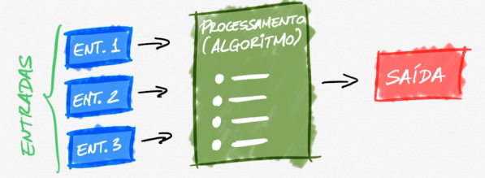

## Entrada, processamento e saída

**Algoritmos são o processamento dos dados.**

<mark>💡 Os dados são as entradas, o algoritmo é o processamento e a saída é o resultado dele. </mark>

Exemplo:

 1. **Entradas de uma receita de bolo:**

- Ovos;
- Farinha;
- Leite;
- Massa;
2. **Processamento**:

- Coloque o ovo numa tigela;

- Coloque a farinha;

3. **Saída**:

- Bolo pronto.