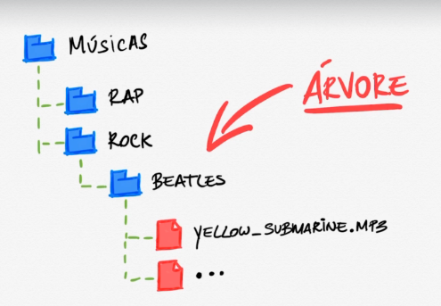
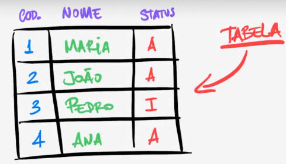
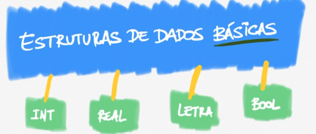
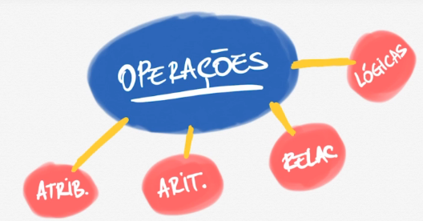

## Visão geral de estrutura de dados

A **estrutura de dados organiza e administra** os dados.

### Exemplos de estrutura de dados:

### Lista

Ordem importa d acordo com uma condição.

### Fila

**FIFO → FIRST IN, FIRST OUT**

O primeiro a entrar é o primeiro a sair.

### Pilha

**LIFO → LAST IN, FIRST OUT**

O último a entrar é o primeiro a sair.

### Árvore

### Tabela

### Estruturas de dados básicas

Você armazena um tipo de dado em uma **VARIÁVEL ou CONSTANTE** e realiza **operações** com eles:

1. Atribuir valores;
2. Operações aritméticas;
3. Relacionar e comparar dados;
4. Operações lógicas, atribuindo condição para que determinado dado seja relevante;
5. União listas de dados.