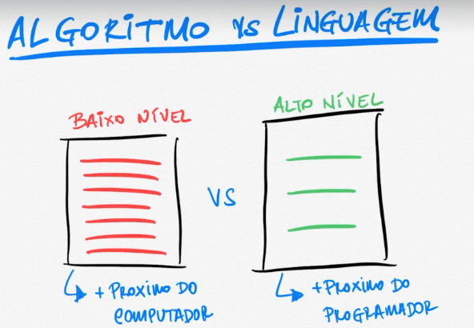

## Algoritmo vs Linguagem

Algumas **LINGUAGENS** são mais próximas do computador e outras mais próximas de quem programa.

As linguagens de **ALTO NÍVEL** são mais simples do que as de baixo nível, que exigem mais linhas de código para exemplificar o mesmo resultado. 

O algoritmo pode gerar o mesmo resultado, mas dependerá do nível da linguagem utilizada, podendo se complicar mais.