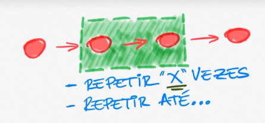
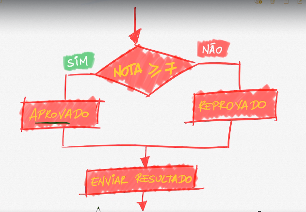
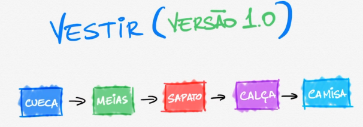
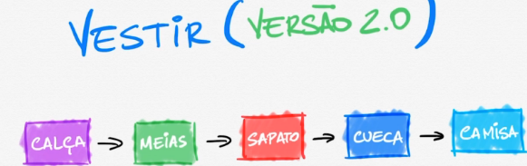

# Visão geral de algoritmo

<mark>💡 **Algoritmo** é uma sequência de passos de um ponto **A** para ponto **B, podendo se repetir ou não.**
</mark>

## Condição

**Na imagem, ele repete dois passos até que a condição seja satisfeita.**

## Decisão

Também pode decidir que passo tomar com base em alguma condição estabelecida:

**Se a nota for maior ou igual a 7, SIM → Aprovado. Se menor, reprovado. Ambos enviam o resultado no final.**

## Algoritmos na vida real

Existe um passo a passo para todos os processos. 

**Algoritmo não é software, mesmo que sejam utilizados na criação de um.**

### Vestir 1.0

Otimizado? Não. Sapato colocado antes da calça.

### Vestir 2.0

…

### Vestir 3.0

